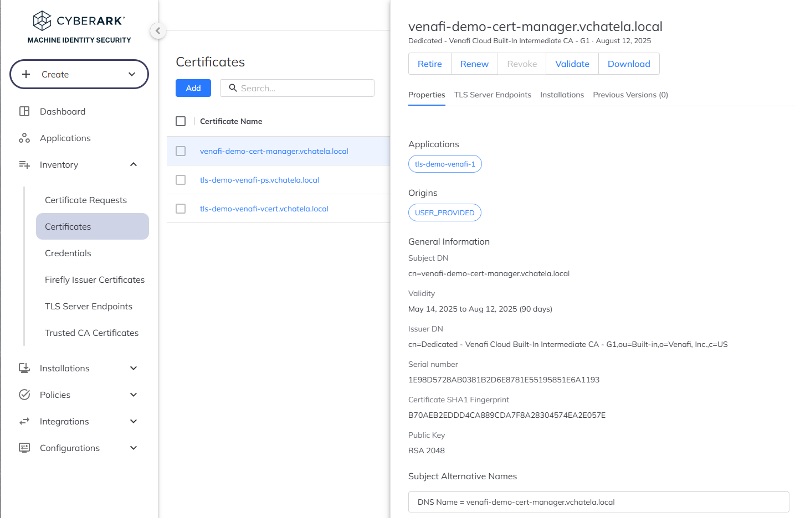

# Cert-Manager with Venafi Cloud (or any other Issuer)
This example demonstrates how to use [**cert-manager**](https://cert-manager.io) to automate TLS certificate issuance with **Venafi Cloud** as the certificate authority. This approach enables native Kubernetes integration using custom resources like `Issuer` and `Certificate`.

All operations are backed by the **Venafi Cloud Built-In CA** through the 30-day trial account.

---

## 📁 Contents

| Use Case                       | Tooling        | Files                                               | Description                                                    |
| ------------------------------ | -------------- | --------------------------------------------------- | -------------------------------------------------------------- |
| ✅ Kubernetes-native enrollment | `cert-manager` | `venafi-cloud-issuer.yaml`, `venafi-demo-cert.yaml` | Define a `Issuer` and issue a cert using K8s-native resources  |
| ✅ HTTPS service example        | `nginx` + TLS  | `nginx-tls-deployment.yaml`                         | Serves HTTPS with the issued cert, using a Kubernetes `Secret` |

---

## 🧩 Prerequisites
* A Venafi Cloud trial account
* A valid Venafi Cloud API key
* Kubernetes cluster with [cert-manager installed](https://cert-manager.io/docs/installation/)
This cluster has been setup with `1-prepapre-kind.sh` and `2-setup-kind.sh`. For cert manager you can apply: `install-cert-manager.sh`.

---

## 🚀 Use Case: Enroll via `cert-manager`

This section shows how to configure `cert-manager` to request certificates from Venafi Cloud.

### 🔑 Step 1: Register Your API Key

Create a Kubernetes secret in the `default` namespace:

```bash
kubectl create secret generic cloud-secret \
  --namespace=default \
  --from-literal=apikey='YOUR_API_KEY_HERE'
```

### 🧾 Step 2: Create the Issuer and Certificate

In here you will create the `Issuer`, then the `Certificate` that you will finally inspect.

```bash
$ kubectl apply -f venafi-cloud-issuer.yaml
issuer.cert-manager.io/cloud-venafi-issuer created
$ kubectl apply -f venafi-demo-cert.yaml
certificate.cert-manager.io/venafi-demo-cert-manager created
$ kubectl get certificaterequests -n default
NAME                         APPROVED   DENIED   READY   ISSUER         REQUESTER                                         AGE
venafi-demo-cert-manager-1   True                False   venafi-cloud   system:serviceaccount:cert-manager:cert-manager   26s
$ kubectl describe certificaterequest venafi-demo-cert-manager-1  -n default
Name:         venafi-demo-cert-manager-1
Namespace:    default
Labels:       <none>
Annotations:  cert-manager.io/certificate-name: venafi-demo-cert-manager
              cert-manager.io/certificate-revision: 1
              cert-manager.io/private-key-secret-name: venafi-demo-cert-manager-9wlmq
              venafi.cert-manager.io/pickup-id: 76817da0-309a-11f0-859f-89daa42a9101
API Version:  cert-manager.io/v1
Kind:         CertificateRequest
Metadata:
  Creation Timestamp:  2025-05-14T08:07:09Z
  Generation:          1
  Owner References:
    API Version:           cert-manager.io/v1
    Block Owner Deletion:  true
    Controller:            true
    Kind:                  Certificate
    Name:                  venafi-demo-cert-manager
    UID:                   4c8ce20e-712c-44f6-8b51-c1f4dc716c01
  Resource Version:        3725
  UID:                     e58dea81-afc3-420c-8fb5-2bba4fb4f1ea
Spec:
  Duration:  2160h0m0s
[...]
Conditions:
    Last Transition Time:  2025-05-14T08:07:09Z
    Message:               Certificate request has been approved by cert-manager.io
    Reason:                cert-manager.io
    Status:                True
    Type:                  Approved
    Last Transition Time:  2025-05-14T08:07:26Z
    Message:               Certificate fetched from issuer successfully
    Reason:                Issued
    Status:                True
    Type:                  Ready
Events:
  Type    Reason              Age   From                                                Message
  ----    ------              ----  ----                                                -------
  Normal  cert-manager.io     29s   cert-manager-certificaterequests-approver           Certificate request has been approved by cert-manager.io
  Normal  CertificateIssued   12s   cert-manager-certificaterequests-issuer-venafi      Certificate fetched from issuer successfully

$ kubectl get secret venafi-demo-cert-manager-tls -o yaml
apiVersion: v1
data:
  ca.crt: XXXXX
  tls.crt: XXXXX
  tls.key: XXXXX
kind: Secret
metadata:
  annotations:
    cert-manager.io/alt-names: venafi-demo-cert-manager.vchatela.local
    cert-manager.io/certificate-name: venafi-demo-cert-manager
    cert-manager.io/common-name: venafi-demo-cert-manager.vchatela.local
    cert-manager.io/ip-sans: ""
    cert-manager.io/issuer-group: ""
    cert-manager.io/issuer-kind: Issuer
    cert-manager.io/issuer-name: cloud-venafi-issuer
    cert-manager.io/uri-sans: ""
  creationTimestamp: "2025-05-14T08:07:26Z"
  labels:
    controller.cert-manager.io/fao: "true"
  name: venafi-demo-cert-manager-tls
  namespace: default
  resourceVersion: "3726"
  uid: 6ef40a95-077b-4f6d-b7a9-e53988c267b2
type: kubernetes.io/tls
$ kubectl get secret venafi-demo-cert-manager-tls -o jsonpath="{.data['tls\.crt']}" | base64 -d | openssl x509 -noout -text
Certificate:
    Data:
        Version: 3 (0x2)
        Serial Number:
            1e:98:d5:72:8a:b0:38:1b:2d:6e:87:81:e5:51:95:85:1e:6a:11:93
        Signature Algorithm: sha256WithRSAEncryption
        Issuer: C = US, O = "Venafi, Inc.", OU = Built-in, CN = Dedicated - Venafi Cloud Built-In Intermediate CA - G1
        Validity
            Not Before: May 14 08:06:51 2025 GMT
            Not After : Aug 12 08:07:21 2025 GMT
        Subject: CN = venafi-demo-cert-manager.vchatela.local
        [...]
        X509v3 extensions:
            X509v3 Extended Key Usage:
                TLS Web Server Authentication, TLS Web Client Authentication
            X509v3 Subject Key Identifier:
                71:B5:81:3F:B2:9C:E1:B3:60:F5:64:E6:60:B7:E4:85:55:5B:3C:8C
            X509v3 Authority Key Identifier:
                D1:BC:92:4C:7B:F6:19:DB:AD:EE:56:0F:FA:1D:F6:B8:5A:DB:CE:06
            Authority Information Access:
                CA Issuers - URI:http://builtinca.venafi.eu/v1/builtinca/cachain/6e3d8d30-3006-11f0-b716-d33452115e41-IntermediateCA
            X509v3 CRL Distribution Points:
                Full Name:
                  URI:http://builtinca.venafi.eu/v1/builtinca/crl/6e3d8d30-3006-11f0-b716-d33452115e41-IntermediateCA
            X509v3 Subject Alternative Name:
                DNS:venafi-demo-cert-manager.vchatela.local
            X509v3 Key Usage: critical
                Digital Signature, Key Encipherment
         [...]
```

---

## 🌐 Serve via HTTPS (Nginx Example)

Deploy a simple HTTPS server using the generated certificate:

```bash
kubectl apply -f nginx-tls-deployment.yaml
```

Then, forward the HTTPS port:

```bash
kubectl port-forward svc/nginx-tls 8443:443
```

In another terminal, test the TLS connection:

```bash
curl -vk https://localhost:8443
```

You should see output confirming the certificate is served correctly, including:

```
* Host localhost:8443 was resolved.
* IPv6: ::1
* IPv4: 127.0.0.1
*   Trying [::1]:8443...
* Connected to localhost (::1) port 8443
* ALPN: curl offers h2,http/1.1
[...]
* SSL connection using TLSv1.3 / TLS_AES_256_GCM_SHA384 / X25519 / RSASSA-PSS
* ALPN: server accepted http/1.1
* Server certificate:
*  subject: CN=venafi-demo-cert-manager.vchatela.local
*  start date: May 14 08:06:51 2025 GMT
*  expire date: Aug 12 08:07:21 2025 GMT
*  issuer: C=US; O=Venafi, Inc.; OU=Built-in; CN=Dedicated - Venafi Cloud Built-In Intermediate CA - G1
*  SSL certificate verify result: unable to get local issuer certificate (20), continuing anyway.
*   Certificate level 0: Public key type RSA (2048/112 Bits/secBits), signed using sha256WithRSAEncryption
*   Certificate level 1: Public key type RSA (2048/112 Bits/secBits), signed using sha256WithRSAEncryption
* using HTTP/1.x
> GET / HTTP/1.1
> Host: localhost:8443
> User-Agent: curl/8.5.0
> Accept: */*
>
* TLSv1.3 (IN), TLS handshake, Newsession Ticket (4):
* TLSv1.3 (IN), TLS handshake, Newsession Ticket (4):
* old SSL session ID is stale, removing
< HTTP/1.1 200 OK
< Server: nginx/1.28.0
< Date: Wed, 14 May 2025 08:20:20 GMT
< Content-Type: application/octet-stream
< Content-Length: 22
< Connection: keep-alive
<
* Connection #0 to host localhost left intact
Hello from Venafi TLS!
```

---

## Venafi Overview

---

## 🔗 References

* [📘 cert-manager Docs (Venafi)](https://cert-manager.io/v1.16-docs/configuration/venafi/)
* [🧪 Venafi Cloud Trial](https://www.cyberark.com/try-buy/certificate-manager-saas-trial/)
* [🔐 Venafi Cloud Docs](https://docs.venafi.cloud)