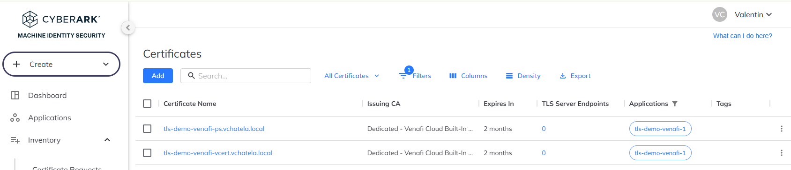

# 🔐 Venafi Cloud Integration Examples

This folder provides real-world examples of automating TLS certificate issuance using **Venafi Cloud**.

All examples use the built-in `Default` Certificate Authority available in the 30-day Venafi Cloud trial.

---

## 📁 Contents

| Use Case     | Tooling           | Script/File        | Description                                            |
| ------------ | ----------------- | ------------------ | ------------------------------------------------------ |
| ✅ CLI usage  | `vcert` (Bash)    | `request_cert.sh`  | Bash script to request a certificate from Venafi Cloud |
| ✅ PowerShell | `VenafiPS` module | `request_cert.ps1` | PowerShell equivalent for Windows environments         |

---

## 🧩 Prerequisites

### 1. Venafi Cloud Setup

1. [Start a 30-day Venafi Cloud trial](https://www.cyberark.com/try-buy/certificate-manager-saas-trial/)

2. Log into your portal (e.g., `https://eval-xxxxxxxx.venafi.cloud/`)

3. Generate an API key:

   * Click your avatar → **Preferences** → **API Keys**

4. Export the API key as an environment variable:

   **Bash**

   ```bash
   export VCERT_APIKEY="YOUR_API_KEY_HERE"
   echo 'export VCERT_APIKEY="YOUR_API_KEY_HERE"' >> ~/.bashrc
   ```

   **PowerShell**

   ```powershell
   $env:VCERT_APIKEY = "YOUR_API_KEY_HERE"
   ```

5. Create a new application in the Venafi Cloud UI:

   * Go to **Applications** → **Add Application**
   * Name: e.g., `tls-demo-venafi-1`
   * Owner: yourself
   * Template: `Default`

### 2. (Optional) Setup vSatellite for Key Generation

To allow Venafi to generate private keys securely, deploy a [vSatellite](https://docs.venafi.cloud/vsatellite/t-VSatellite-deployNew/):

```bash
sudo ./vsatctl preflight --api-url https://api.eu.venafi.cloud/
sudo ./vsatctl install --pairing-code XXXXXXX --api-url https://api.eu.venafi.cloud/
```

Sample output:

```
INFO Registering with cloud...
INFO Venafi VSatellite registration successful
...
INFO VSatellite installation has been completed successfully!
```

---

## 🚀 Use Case 1: Bash with `vcert`

This example uses the `vcert` CLI to request a certificate from Venafi Cloud.

### 🔧 Install `vcert`

Ensure the `vcert` binary is available:

```bash
./install-vcert.sh
```

### 📝 Request a Certificate

Run the script:

```bash
$ ./request_cert.sh
Enter key passphrase:***
Verifying - Enter key passphrase:***
vCert: 2025/05/13 17:06:13  Warning: command line parameter -k has overridden environment variable VCERT_APIKEY 
vCert: 2025/05/13 17:06:13 Successfully connected to Venafi as a Service
vCert: 2025/05/13 17:06:13 Successfully read zone configuration for tls-demo-venafi-1\Default
vCert: 2025/05/13 17:06:13 Successfully created request for tls-demo-venafi-vcert.vchatela.local
vCert: 2025/05/13 17:06:16 Successfully posted request for tls-demo-venafi-vcert.vchatela.local, will pick up by cf7489a0-300b-11f0-aac3-b5b2a373686d
vCert: 2025/05/13 17:06:16 Successfully retrieved request for cf7489a0-300b-11f0-aac3-b5b2a373686d
PickupID="cf7489a0-300b-11f0-aac3-b5b2a373686d"
Certificate issued and saved:
- Cert: artefacts/vcert-cert.pem
- Key: artefacts/vcert-key.pem
- Chain: artefacts/vcert-chain.pem
```

---

## 🚀 Use Case 2: PowerShell with `VenafiPS`

This example shows how to request a certificate on Windows using the official `VenafiPS` module.

### 🔧 Install VenafiPS

```powershell
Install-Module VenafiPS -Scope CurrentUser -Force
```

### 📝 Request a Certificate

```powershell
$ .\request_cert.ps1
[INFO] Connecting to Venafi Cloud...
[INFO] Requesting certificate for CN: tls-demo-venafi-ps.vchatela.local...

✅ Certificate issued and saved:
- Cert:  artefacts/venafips-cert.pem
- Chain: artefacts/venafips-chain.pem
```

---

## 🖥️ Venafi Cloud UI

View your issued certificates directly in the Venafi Cloud portal:



---

## 🔗 References

* [📘 Venafi Cloud Documentation](https://docs.venafi.cloud)
* [🔧 vcert GitHub](https://github.com/Venafi/vcert)
* [🚀 Venafi Cloud Trial](https://www.cyberark.com/try-buy/certificate-manager-saas-trial/)
